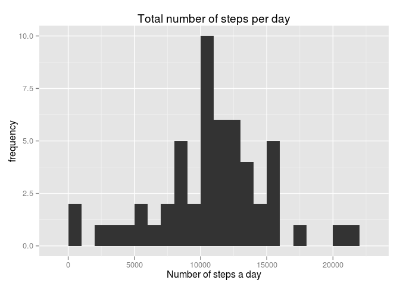
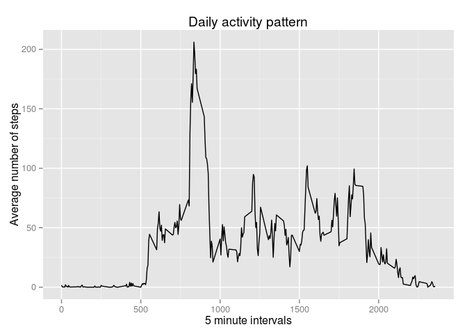
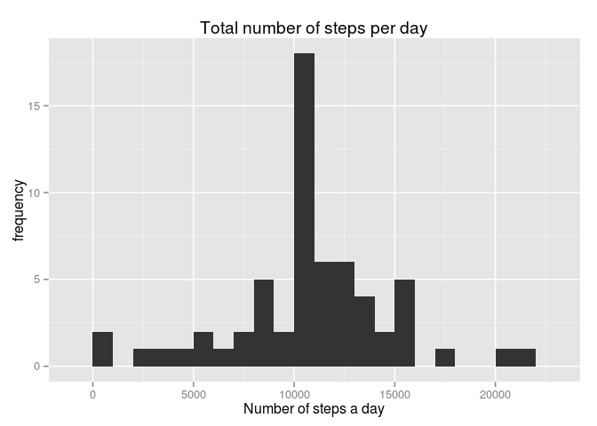
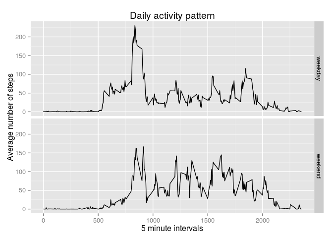

# Reproducible Research: Peer Assessment 1

Used packages:

```r
library(ggplot2)
library(plyr)
library(dplyr)
```

## Loading and preprocessing the data
I created some later useful summary tables here.

```r
activity <- read.csv("activity.csv")
daily_activity <- ddply(activity, c("date"), summarise, steps = sum(steps))
interval_activity <- ddply(activity, c("interval"), summarise, avgSteps = mean(steps, na.rm = TRUE))
```

## What is the total number of steps taken per day?

```r
qplot(daily_activity$steps, xlab = "Number of steps a day", ylab = "frequency", main = "Total number of steps per day", binwidth = 1000)
```

 

```r
mean <- mean(daily_activity$steps, na.rm = TRUE)
median <- median(daily_activity$steps, na.rm = TRUE)
```
The mean of total number of steps taken a day is 10766.

The median of the total number of steps taken a day is 10765.

## What is the average daily activity pattern?

```r
qplot(interval, avgSteps, data = interval_activity, geom = "line", xlab = "5 minute intervals", ylab = "Average number of steps", main = "Daily activity pattern")
```

 

```r
intervalWithMax <- interval_activity$interval[which.max(interval_activity$avgSteps)]
```
Code number of the interval with maximum number of steps on average: 835.

## Imputing missing values
I create a new dataset where I replace missing values with the mean number of steps for that interval.


```r
missing <- sum(is.na(activity$steps))
```
Total number of missing values is 2304.

```r
activityNoMissing <- activity
for (i in 1:nrow(activityNoMissing)) {
    if(is.na(activityNoMissing$steps[i])) {
       interval <- activityNoMissing$interval[i]
       m <- interval_activity[interval_activity$interval == interval,2]
       activityNoMissing$steps[i] <- m
    }
}
daily_activity_no_missing <- ddply(activityNoMissing, c("date"), summarise, steps = sum(steps))
qplot(daily_activity_no_missing$steps, xlab = "Number of steps a day", ylab = "frequency", main = "Total number of steps per day", binwidth = 1000)
```

 

```r
newMean <- mean(daily_activity_no_missing$steps, na.rm = TRUE)
newMedian <- median(daily_activity_no_missing$steps, na.rm = TRUE)
```
In this new dataset, the mean of total number of steps taken a day is 10766.

The median of the total number of steps taken a day is 10766.

The mean did not change due to the fact that I replaced missing values with the mean, but the total number of steps increased.

## Are there differences in activity patterns between weekdays and weekends?

```r
weekdays <- c("Monday", "Tuesday", "Wednesday", "Thursday", "Friday")
activityNoMissing <- mutate(activityNoMissing, weekday = ifelse(weekdays(as.Date(date)) %in% weekdays,"weekday","weekend"))
interval_activity_no_missing <- ddply(activityNoMissing, c("interval", "weekday"), summarise, avgSteps = mean(steps, na.rm = TRUE))
qplot(interval, avgSteps, data = interval_activity_no_missing, geom = "line", xlab = "5 minute intervals", ylab = "Average number of steps", main = "Daily activity pattern", facets = weekday~.)
```

 
